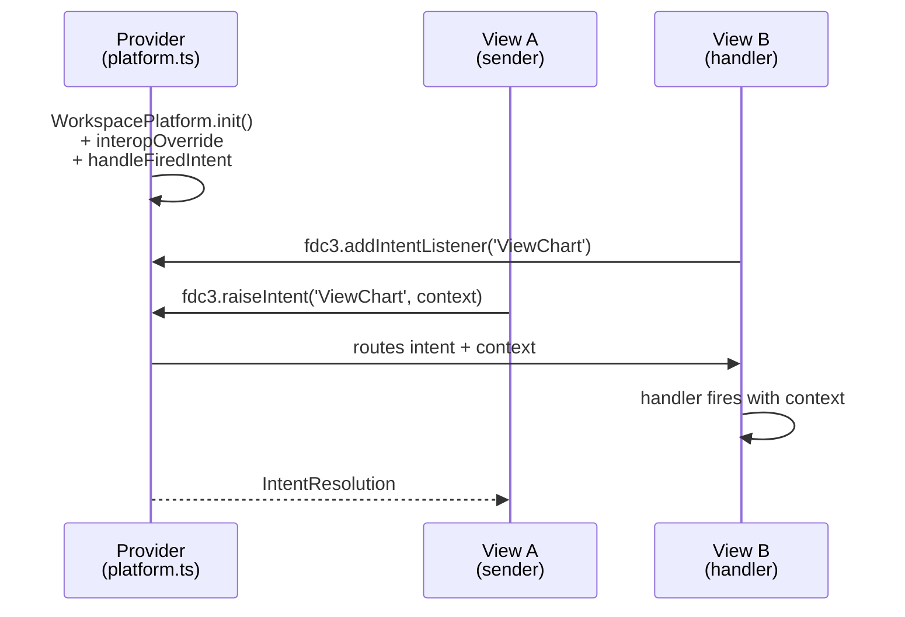

# FDC3 Intent Implementation Guide

Reference guide for implementing FDC3 intent-based communication between views in this OpenFin platform.

> **Prerequisite**: This guide assumes you have migrated to `@openfin/workspace-platform`. See [WORKSPACE-PLATFORM-MIGRATION.md](./WORKSPACE-PLATFORM-MIGRATION.md) for migration steps.

## Goal

Fire an intent from one view and handle it in another view, using FDC3 standard APIs.

## Architecture Overview



**Reference links:**

- [WorkspacePlatform.init](https://developer.openfin.co/workspace/docs/platform/latest/functions/init.html) | [WorkspacePlatformInitConfig](https://developer.openfin.co/workspace/docs/platform/latest/interfaces/WorkspacePlatformInitConfig.html)
- [InteropBroker](https://developer.openfin.co/docs/javascript/stable/classes/OpenFin.InteropBroker.html) | [handleFiredIntent](https://developer.openfin.co/docs/javascript/stable/tutorial-interop.fireIntent.html)
- [fdc3.addIntentListener](https://fdc3.finos.org/docs/api/ref/DesktopAgent#addintentlistener)
- [fdc3.raiseIntent](https://fdc3.finos.org/docs/api/ref/DesktopAgent#raiseintent)
- [IntentResolution](https://fdc3.finos.org/docs/api/ref/Types#intentresolution)

## Implementation Steps

### 1. Enable FDC3 in Views

In `public/app.json` (or `manifest.fin.json`), add `defaultViewOptions` to enable FDC3 for all views:

```json
{
  "platform": {
    "uuid": "openfin-custom-platform",
    "defaultViewOptions": {
      "fdc3InteropApi": "2.0"
    },
    "defaultWindowOptions": {
      ...
    }
  }
}
```

### 2. Configure InteropBroker (Provider Side)

In `platform.ts`, add `interopOverride` to `WorkspacePlatform.init()`:

```typescript
import * as WorkspacePlatform from "@openfin/workspace-platform";

export const initializePlatform = async () => {
  await WorkspacePlatform.init({
    browser: null, // Using custom platform windows

    interopOverride: async (InteropBroker, ...args) => {
      class CustomBroker extends InteropBroker {
        async handleFiredIntent(intent: OpenFin.Intent) {
          console.log("Intent fired:", intent);

          // Option A: Let default behavior handle it (if handler is registered)
          return super.handleFiredIntent(intent);

          // Option B: Explicit targeting (spawn or target specific view)
          // super.setIntentTarget(intent, { uuid: 'openfin-custom-platform', name: 'target-view' })
        }
      }
      return new CustomBroker(...args);
    },
  });

  const platform = fin.Platform.getCurrentSync();
  // ... window creation
};
```

**Alternative: `interopOverride` inside `browser` config**

If using the Workspace Browser UI instead of custom windows:

```typescript
await WorkspacePlatform.init({
  browser: {
    title: "My Platform",
    interopOverride: async (InteropBroker, ...args) => {
      // Same CustomBroker implementation
      return new CustomBroker(...args);
    },
  },
});
```

Both placements work — top-level `interopOverride` applies platform-wide.

### 3. Register Intent Handler (Receiving View)

In the receiving view component, register the handler on mount:

```typescript
import { useEffect } from 'react'

function ReceiverView() {
  useEffect(() => {
    if (typeof fdc3 === 'undefined') return

    // Must register within 15 seconds of app launch
    const registerHandler = async () => {
      const listener = await fdc3.addIntentListener('ViewChart', (context) => {
        console.log('Received context:', context)
        // Handle the intent - update UI, fetch data, etc.
        // context.type will be 'fdc3.instrument' (or custom type)
        // context.id will contain { ticker: 'AAPL' } etc.
      })

      return () => listener.unsubscribe()
    }

    // Wait for fdc3Ready event
    if (window.fdc3) {
      registerHandler()
    } else {
      window.addEventListener('fdc3Ready', registerHandler)
    }
  }, [])
}
```

### 4. Raise Intent (Sending View)

In the sending view, raise the intent with context:

```typescript
const raiseViewChartIntent = async (ticker: string) => {
  if (typeof fdc3 === 'undefined') return

  const context = {
    type: 'fdc3.instrument',
    id: { ticker }
  }

  try {
    const resolution = await fdc3.raiseIntent('ViewChart', context)
    console.log('Intent resolved:', resolution)
  } catch (error) {
    console.error('Intent failed:', error)
  }
}
```

## Key Types

```typescript
// FDC3 Context (standard instrument example)
interface InstrumentContext {
  type: 'fdc3.instrument'
  name?: string
  id: {
    ticker?: string
    ISIN?: string
    CUSIP?: string
    // other identifiers
  }
}

// Custom context type example
interface CustomContext {
  type: 'myapp.order'
  id: { orderId: string }
  data?: Record<string, unknown>
}

// Intent resolution returned by raiseIntent
interface IntentResolution {
  source: { appId: string; instanceId?: string }
  intent: string
  getResult?: () => Promise<unknown>
}
```

## Standard FDC3 Intents

Common built-in intents you can use:

| Intent | Description | Typical Context Types |
|--------|-------------|----------------------|
| `ViewChart` | Display chart for instrument | fdc3.instrument |
| `ViewQuote` | Show quote/price | fdc3.instrument |
| `ViewNews` | Show news | fdc3.instrument |
| `ViewInstrument` | General instrument view | fdc3.instrument |
| `StartChat` | Open chat | fdc3.contact |

You can also define custom intents (namespace recommended: `myapp.CustomIntent`).

## File Modifications Required

1. **`src/platform.ts`** - Add `interopOverride` to `WorkspacePlatform.init()`
2. **`public/app.json`** - Add `defaultViewOptions.fdc3InteropApi: "2.0"`
3. **`src/types/openfin.d.ts`** - Add FDC3 type declarations if needed
4. **`src/App.tsx`** - Split into sender/receiver components OR create new view components
5. **New files** - Consider `src/SenderView.tsx` and `src/ReceiverView.tsx`

## Recommended Approach

For a minimal demo:

1. Create two distinct view components (or differentiate by URL param)
2. Sender view: button that calls `fdc3.raiseIntent('ViewChart', { type: 'fdc3.instrument', id: { ticker: 'AAPL' }})`
3. Receiver view: `useEffect` that registers `fdc3.addIntentListener('ViewChart', handler)`
4. Handler updates React state to display received context

## FDC3 Ready Check Pattern

Always ensure FDC3 is ready before use:

```typescript
const useFdc3 = () => {
  const [ready, setReady] = useState(false)

  useEffect(() => {
    if (typeof window !== 'undefined' && window.fdc3) {
      setReady(true)
    } else {
      const handler = () => setReady(true)
      window.addEventListener('fdc3Ready', handler)
      return () => window.removeEventListener('fdc3Ready', handler)
    }
  }, [])

  return ready
}
```

## TypeScript Declarations

Add to `src/types/fdc3.d.ts` or extend `openfin.d.ts`:

```typescript
interface Fdc3Context {
  type: string
  name?: string
  id?: Record<string, string>
  [key: string]: unknown
}

interface Fdc3Listener {
  unsubscribe: () => void
}

interface Fdc3IntentResolution {
  source: { appId: string; instanceId?: string }
  intent: string
  getResult?: () => Promise<unknown>
}

declare global {
  const fdc3: {
    raiseIntent(intent: string, context: Fdc3Context, app?: string): Promise<Fdc3IntentResolution>
    addIntentListener(intent: string, handler: (context: Fdc3Context) => void): Promise<Fdc3Listener>
    // Add other methods as needed
  } | undefined

  interface Window {
    fdc3?: typeof fdc3
  }
}
```

**Type references:**

- [Context](https://fdc3.finos.org/docs/api/ref/Types#context)
- [Listener](https://fdc3.finos.org/docs/api/ref/Types#listener)
- [IntentResolution](https://fdc3.finos.org/docs/api/ref/Types#intentresolution)
- [DesktopAgent](https://fdc3.finos.org/docs/api/ref/DesktopAgent) (the `fdc3` global object)

## Testing

1. Run `npm run dev` and note the network IP
2. Update `public/app.json` and `src/platform.ts` with the IP
3. Launch the OpenFin app on Windows
4. Both views should appear
5. Click button in sender view
6. Receiver view should display the received context

## References

- [WorkspacePlatform.init](https://developer.openfin.co/workspace/docs/platform/latest/functions/init.html)
- [WorkspacePlatformInitConfig](https://developer.openfin.co/workspace/docs/platform/latest/interfaces/WorkspacePlatformInitConfig.html)
- [OpenFin InteropBroker API](https://developer.openfin.co/docs/javascript/stable/classes/OpenFin.InteropBroker.html)
- [FDC3 Intents Specification](https://fdc3.finos.org/docs/intents/spec)
- [FDC3 ViewChart Intent](https://fdc3.finos.org/docs/1.2/intents/ref/ViewChart)
- [OpenFin FDC3 Support](https://developers.openfin.co/of-docs/docs/fdc3-support-in-openfin)
- [workspace-starter examples](https://github.com/built-on-openfin/workspace-starter)
