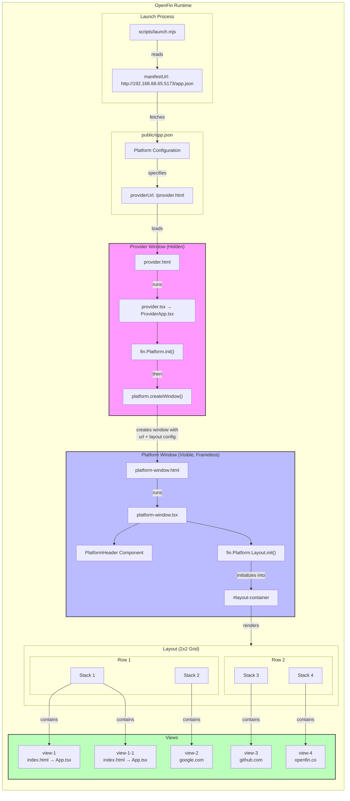

# OpenFin Custom Platform Windows

An OpenFin application built with Vite, React 19, and TypeScript featuring a custom frameless platform window.

## Architecture



## URL Relationships

| Component | URL | Role |
|-----------|-----|------|
| **Manifest** | `http://192.168.68.65:5173/app.json` | Entry point for OpenFin runtime |
| **Provider** | `/provider.html` | Hidden window that initializes the platform |
| **Platform Window** | `/platform-window.html` | Visible frameless window with custom chrome |
| **Local Views** | `/index.html` (root) | React app content loaded in views |
| **External Views** | google.com, github.com, openfin.co | External sites loaded in views |

## Loading Flow

1. **Launch** - `launch.mjs` tells OpenFin to fetch `app.json`
2. **Manifest** - OpenFin creates hidden provider window from `providerUrl`
3. **Provider** - Calls `fin.Platform.init()` then `platform.createWindow()` with layout config
4. **Platform Window** - Loads `platform-window.html`, runs `Layout.init()` into `#layout-container`
5. **Views** - Layout system loads each view URL into its designated stack

## Commands

```bash
npm run dev          # Start Vite dev server
npm run build        # TypeScript compile + Vite build
npm run lint         # Run ESLint
npm run start        # Dev server + OpenFin together
npm run openfin      # Launch OpenFin only
```

## Project Structure

```
src/
├── main.tsx           # React entry point
├── App.tsx            # Main component
├── provider.tsx       # Provider entry point
├── ProviderApp.tsx    # Platform initialization
├── platform-window.tsx # Layout initialization for custom window
├── types/openfin.d.ts # Global fin type declaration
public/
├── app.json           # OpenFin manifest
scripts/
└── launch.mjs         # OpenFin launcher
platform-window.html   # Custom platform window (frameless)
provider.html          # Provider window
index.html             # View content (React app)
```
